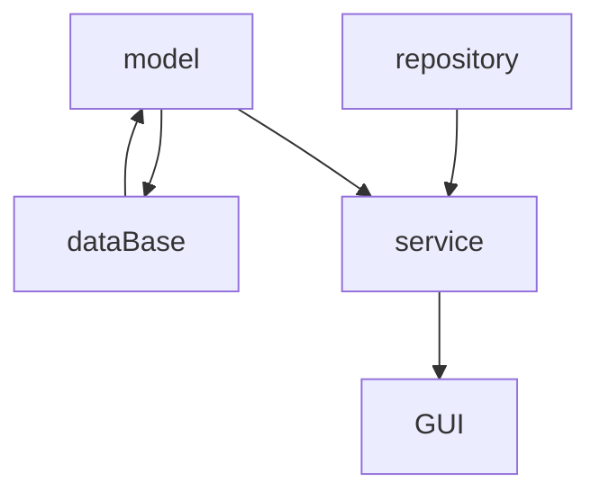

# GYM FIT (now using spring)

---

**application.properties** is not in the repository because I currently do not know a way to ensure that the database password is not in plain text. but...

---
``` 
spring.application.name=gym_fit

# CONNECTION MYSQL
spring.datasource.url=jdbc:mysql://localhost:1504/gym_fit_db
spring.datasource.username=root
spring.datasource.password=
spring.datasource.driver-class-name=com.mysql.cj.jdbc.Driver

# DATABASE SCHEMA
spring.jpa.hibernate.ddl-auto=none
spring.jpa.show-sql=false

# DISABLE TOMCAT
spring.main.web-application-type=none'

``` 
---
## Architecture diagram 

---

## DATA BASE QUERY
```sql
CREATE TABLE client (
    ID INT PRIMARY KEY NOT NULL AUTO_INCREMENT,
    NAME VARCHAR(43),
    MEMBERSHIP INT UNIQUE
);
```